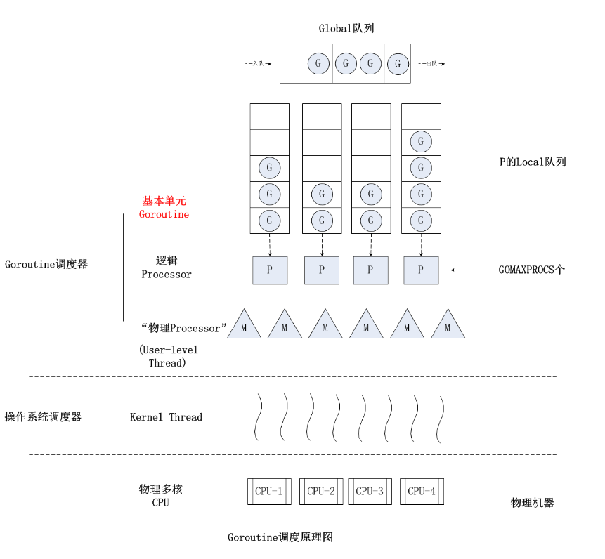
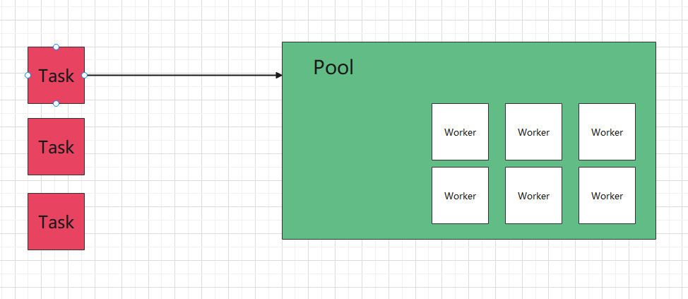
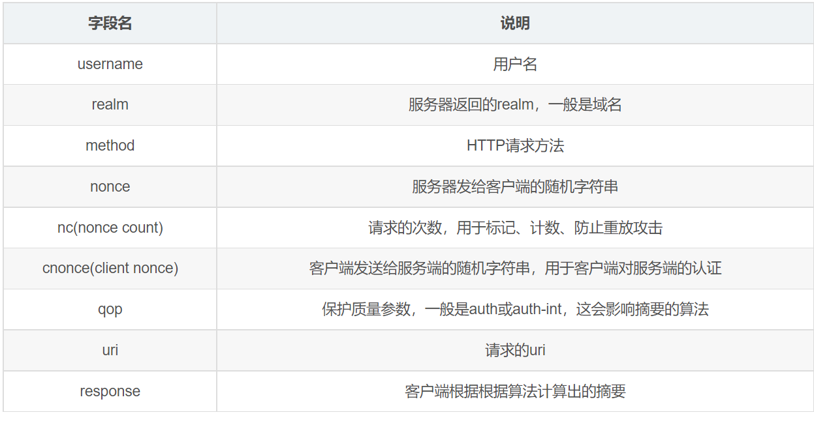

# 参数处理
## 1. query参数
> 首先处理query参数，比如：http://xxx.com/user/add?id=1&age=20&username=张三
> 
> 记得将路由的URL匹配改为：uri := ctx.R.URL.Path

### 1.1 map类型参数
类似于 `http://loaclhost:8080/queryMap?user[id]=1&user[name]=张三`

## 2. Post表单参数
> 获取表单参数借助 http.Request.PostForm

Form属性包含了post表单和url后面跟的get参数。
PostForm属性只包含了post表单参数。

## 3. 文件参数
> 借助http.Request.FormFile

# 错误处理
>当程序发生异常的时候，比如panic程序直接就崩溃了，很明显在应用运行的过程中，不允许发生这样的事情，那么我们的框架就需要支持对这样问题的处理

对这样问题的处理，我们很容易想到recover，他会捕获panic错误，同时我们应当在defer进行捕获，defer是一个先进后出的栈结构，在return之前执行

<b>recover函数只在defer中生效</b>

## 1. Recovery中间件

## 2. 打印出错位置
>像这种处理异常的行为，单纯的报error没有意义，我们需要打印出出错位置

这里我们要用到runtime.Caller, Caller()报告当前go调用栈所执行的函数的文件和行号信息
- `skip`  
上溯的栈帧数，0表示Caller的调用者(Caller所在的调用栈) (0-当前函数,1-上一层函数,...)

- `pc`  
调用栈标识符

- `file`  
文件路径

- `line`  
该调用在文件中的行号

- `ok`  
如果无法获得信息，ok会被设为false

Callers 用来返回调用栈的程序计数器，第0个Caller是Callers本身，第1个是上一层trace，第2个是再上一层的`defer func`

# 协程池
>go的优势是高并发，高并发是由go+channel的组合来完成的。  

## 1.GMP模型  


- 每个P维护一个G的本地队列
- 当一个G被创建出来，或者变为可执行状态时，优先把它放到P的本地队列中，否则放到全局队列
- 当一个G在M里执行结束后，P会从队列中把该G取出，如果此时P的队列为空，即没有其他G可以执行，如果全局队列为空，它会随机挑选另外一个P，从它的队列里拿走一半G到自己队列中执行

**P的数量在默认情况下，会被设定为CPU的核数。而M虽然需要跟P绑定执行，但数量上并不与P相等。这是因为M会因为系统调用或者其他事情被阻塞，因此随着程序的执行，M的数量可能增长，而P在没有用户干预的情况下，则会保持不变**

### 1.1大量创建go协程的代价
- 内存开销  
go协程大约占2k的内存  
`src/runtime/runtime2.go`  


- 调度开销  
虽然go协程的调度开销非常小，但也有一定的开销。
`runntime.Gosched()`当前协程主动让出CPU去执行另外一个协程 


- gc开销  
协程占用的内存最终需要gc来回收  


- 隐性的CPU开销  
最终协程是要内核线程来执行，我们知道在GMP模型中，G阻塞后，会新创建M来执行，一个M往往对应一个内核线程，当创建大量go协程的时候，内核线程的开销可能也会增大  
```
GO: runtime: program exceeds 10000-thread limit
```
>gmp模型中，本地队列的限制是256  
- 资源开销大的任务  
针对资源开销过大的任务，本身也不应当创建大量的协程，以免对CPU造成过大的任务，影响整体上的单机性能
- 任务堆积  
当创建过多协程，G阻塞增多，本地队列堆积过多，很可能造成内存溢出
- 系统任务影响  
runtime调度、gc等都是运行在go协程上的，当goroutine规模过大，会影响其他任务 

## 2. 协程池
基于以上一些理由，有必要创建一个协程池，将协程有效的管理起来，不要随意的创建过多的协程。
`同时池化的核心在于复用，所以我们可以这么想，一个goroutine是否可以处理多个任务，而不是一个goroutine处理一个任务`


### 2.1 需求
罗列一下需求：  
1. 希望创建固定数量的协程
2. 有一个任务队列，等待协程进行调度执行
3. 协程用完时，其他任务处于等待状态，一旦有协程空余，立即获取任务执行
4. 协程长时间空余，清空，以免占用空间
5. 有超时时间，如果一个任务长时间完成不了，就超时，让出协程

### 2.2 设计


### 2.5 引入sync.pool
>将worker的创建放入pool中提取暴露(缓存)，用的时候从pool中获取，用完还回pool中，这样性能更高

### 2.6 引入sync.Cond
sync.Cond 是基于互斥锁/读写锁实现的条件变量，用来协调想要访问共享资源的那些Goroutine。 

当共享资源状态发生变化时，sync.Cond可以用来通知等待条件发生而阻塞的Goroutine。

在上述的场景中，我们可以将其应用在等待worker那里，可以使用sync.Cond阻塞，当worker执行完任务后，通知其继续执行。 

* `Signal方法`，允许调用Caller唤醒一个等待此Cond和goroutine。如果此时没有等待的goroutine，现实无需通知waiter；
如果Cond等待队列中有一个或者多个等待的goroutine，则需要从等待队列中移除第一个goroutine并把它唤醒。
在Java语言中，Signal方法也叫做notify方法。调用Signal方法时，不强求你一定要持有c.L的锁。
* `Broadcast方法`，允许调用者Caller唤醒所有等待此Cond的goroutine。如果此时没有等待的goroutine，显示无需通知waiter；
如果Cond等待队列中有一个或者多个等待的goroutine，则清空所有等待goroutine，并全部唤醒。
在Java语言中，Broadcast方法也叫做notifyAll方法。同样地，调用Broadcast方法时，也不强求你一定持有c.L的锁。
* `Wait方法`，会把调用者Caller放入Cond的等待队列中并阻塞，真到被Signal或者Broadcast的方法从等待队列中移除并唤醒。
调用Wait方法必须要持有c.L的锁

### 2.7 任务超时释放
>针对任务超时，需要使用工具的开发者，在程序中自动处理，及时退出goroutine

### 2.8 异常处理
>当task发生问题时，需要能捕获到，对外提供入口，让开发者自定义错误处理方式

# 认证
## 1.开启https支持
```go
func (e *Engine) RunTLS(addr, certFile, keyFile string){
	err := http.ListenAndServeTLS(addr, certFile, keyFile, e.Handler())
	if err != nil{
		log.Fatal(err)
    }
}
```

### 1.1 测试
* 生存私钥文件
```shell
## 需要输入密码
openssl genrsa -des3 -out ca.key 2048
```
* 创建证书请求
```shell
openssl req -new -key ca.key -out ca.csr
```
*生成ca.crt
```shell
openssl x509 -req -days 365 -in ca.csr -signkey ca.key -out ca.crt
```
  
找到openssl.cnf文件
1. 打开copy_extensions = copy
2. 打开req_extensions = v3_req
3. 找到[v3_req]，添加subjectAltName = @alt_names
4. 添加新的标签[alt_names]，和标签字段
```markdown
[alt_name]
IP.1 = 127.0.0.1
DNS.1 = *.joy.com
```
5. 生成证书私钥server.key
```shell
openssl genpkey -algorithm RSA -out server.key
```
6. 通过私钥server.key生成证书请求文件server.csr
```shell
openssl req -new -nodes -key server.key -out server.csr -days 3650 -config ./openssl.cnf -extensions v3_req
```
7. 生成SAN证书
```shell
openssl x509 -req -days 365 -in server.csr -out server.pem -CA ca.crt -CAkey ca.key -CAcreateserial 
-extfile ./openssl.cnf -extensions v3_req
```
<b>postman</b>
客户端需要生成对应的公钥和私钥
私钥：
```shell
openssl genpkey -algorithm RSA -out client.key
```
证书:
```shell
openssl req -new -nodes -key client.key -out client.csr -days 3650 -config ./openssl.cnf -extensions v3_req
```  
SAN证书:
```shell
openssl x509 -req -days 365 -in client.csr -out client.pem -CA ca.crt -CAkey ca.key -CAcreateserial
-extfile ./openssl.cnf -extensions v3_req
```

## 2.认证支持
### 2.1 Basic认证
Basic认证(基础认证)，是最简单的认证方式。它简单地将用户名：密码进行base64编码后，放到HTTP Authorization Header中。
HTTP请求达到后端服务后，后端服务会解析出Authorization Header中的base64字符串，解析获取用户名和密码，并将用户名和密码跟数据库中记录的值进行比较，
如果匹配则认证通过。  
当base64并不是加密技术，所以这种认证方式并不安全，即使密码进行加密，攻击者也可以进行重放攻击。  
<b>可以和SSL(可以理解为是HTTPS)一起使用保证其安全性</b>
```shell
Authorization: Basic ${basic}
```

### 2.1 Digest认证
Digest认证(摘要认证)，是另一种HTTP认证协议，它与基本认证兼容，但修复了基本认证的严重缺陷。Digest具有如下特点：
* 绝不会用明文方式在网络上发送密码。
* 可以有效防止恶意用户进行重放攻击。
* 可以有选择地防止对报文内容的篡改。  

完成摘要认证需要下面这四步：
* 客户端请求服务端的资源。
* 在客户端能够证明它知道密码从而确认其身份之前，服务端认证失败，返回401 Unauthorized,并返回WWW-Authenticate头，里面包含认证需要的信息。
* 客户端根据WWW-Authenticate头中的信息，选择加密算法，并使用密码随机数nonce，计算出密码摘要response，并再次请求服务端。
* 服务器将客户端提供的密码摘要与服务器内部计算出的摘要进行对比。
如果匹配，就说明客户端知道密码，认证通过，并返回一些与授权会话相关的附加信息，放到Authorization-Info中。    
WWW-Authenticate头中包含的信息见下表：
    
 
虽然使用摘要可以避免密码以明文方式发送，一定程度上保护了密码的安全性，但是仅仅隐藏密码并不能保证请求是安全的。
因为请求(包括密码摘要)仍然可以被截获，这样就可以重放给服务器，带来安全问题。    

为了防止重放攻击，服务器向客户端发送了密码随机数nonce，nonce每次请求都会变化。
客户端会根据nonce生成密码摘要，这种方式，可以使摘要随着随机数的变化而变化。
服务端收到的密码摘要只对特定的随机数有效，而没有密码的话，攻击者就无法计算出正确的摘要，这样我们就可以防止重放攻击。  

摘要认证可以保护密码，比基本认证安全很多。但摘要认证并不能保护内容，所以仍然要与HTTPS配合使用，来确保通信安全。

### 2.3 Bearer认证
Bearer认证，也称为令牌认证，是一种HTTP身份验证方法。Bearer认证的核心是bearer token。  
bearer token是一种加密字符串，通常由服务端根据密钥生成。客户端在请求服务端时，必须在请求头中包含Authorization:Bearer。
服务端收到请求后，解析出，并校验的合法性，如果校验通过，则认证通过。跟Basic认证一样，Bearer认证需要配合HTTPS一起使用，来保证认证安全性。  

当前最流行的token编码方式就是`JSON Web Token`

#### 2.3.1 JWT
JWT(全称：JSON Web Token)是一个开放标准(RFC 7519)，它定义了一种紧凑的、自包含的方式，用于作为JSON对象在各方之间安全地传输信息。
该信息可以被验证和信任，因为它是数字签名的。  
简单点说就是一种认证机制。
JWT一般是这样一个字符串，分为三部分，以"."隔开：
```shell
A.B.C
```

##### Header
A部分：  

JWT第一部分是头部分，它是一个描述JWT元数据的Json对象
```json
{
  "alg" : "HS256",
  "typ" : "JWT"
}
```
alg属性表示签名使用的算法，默认为HMAC SHA256(写为HS256)，typ属性表示令牌的类型，JWT令牌统一写为JWT。  

最后，使用Base64 URL算法将上述JSON对象转换为字符串保存。

##### Payload
B部分：  

JWT第二部分是Payload，也是一个Json对象，除了包含需要传递的数据，还有七个默认的字段供选择。  

分别是  
`iss: 发行人`、`exp:到期时间`、`sub:主题`、`aud:用户`、`nbf:在此之前不可用`、`iat:发布时间`、
`jti:JWT ID用于标识该JWT`。  
```json
{
  //默认字段
  "sub" : "码神之路Go手写微服务框架教程",
  //自定义字段
  "name" : "码神之路",
  "isAdmin" : "true",
  "loginTime": "2022-06-28 12:00:03"
}
```
##### Signature
C部分：  

JWT第三部分是签名。 

首先需要指定一个secret，该secret仅仅保存在服务器中，保证不能让其他用户知道。
Header指定的算法对Header和Payload进行计算，然后就得到一个签名哈希。也就是Signature。  

那么Application Secret如何进行验证呢？可以利用JWT前两段，用同一套哈希算法和同一个secret计算一个签名值，
然后把计算出来的签名值和收到的JWT第三段比较，如果相同则认证通过。  

##### 使用JWT进行认证的步骤：
* 客户端使用用户名和密码请求登录  

* 服务端收到请求后，会去验证用户名和密码。如果用户名和密码跟数据库记录不一致，则验证失败；如果一致则验证通过，服务端会签发一个Token返回给客户端  
 
* 客户端收到请求后会将Token缓存起来，比如放到浏览器Cookie中或者LocalStorage中，之后每次请求都会携带该Token  

* 服务端收到请求后，会验证请求中的Token，验证通过则进行业务逻辑处理，处理完成后返回处理的结果

## 3.配置文件

### 3.1 toml讲解
TOML 旨在成为一个语义显著而易于阅读的最低限度的配置文件格式。
TOML 被设计地能够无歧义地转化为哈希表。
TOML 应当能简单地剖析成形形色色地语言中的数据结构。

### 3.1 说明
+ TOML是大小写敏感的。
+ TOML文件必须是有效的 UTF-8 编码的 Unicode 文档。
+ 空白的意思是Tab（0x09）或空格（0x20）。
+ 换行的意思是LF（0x0A）或CRLF（0x0D 0x0A）

### 3.2 注释
井号并此行剩下的部分标记为注释，除非它在字符串中
```toml
# 这是一个全行注释
key = "value" # 这是一个行末注释
another = "# 这不是一个注释"
```
除 Tab 以外的控制字符(U+0000 至 U+0008，U+000A 至 U+001F，U+007F) 不允许出现在注释中。

### 3.3 键值对
TOML 文档最基本的构成区块是键值对

键名在等号的左边而值在右边。
键名和键值周围的空白会被忽略。
键、等号和值必须在同一行（不过有些值可以跨多行）
```toml
key = "value"
```

值必须是下述类型之一
+ 字符串
+ 整数
+ 浮点数
+ 布尔值
+ 坐标日期时刻
+ 各地日期时刻
+ 各地日期
+ 各地时刻
+ 数组
+ 行内表  

不指定是错误的
```toml
key = #错误
```

键值对后必须换行（或结束文件）。
```toml
first = "汤姆" last = "普雷斯顿-维尔纳" #错误
```

### 3.4 键名
键名可以是裸露对，引号引起来的，或点分隔的。   

<b>裸键</b>只能包含ASCII字母，ASCII数字，下划线或短横线（`A-Za-z0-9_-`）。
注意裸键允许仅由纯ASCII数字构成，例如`1234`，但是被理解为字符串的。
```toml
key = "value"
bare_key = "value"
bare-key = "value"
1234 = "value"
```
<b>点分隔键</b>是一系列通过点相连的裸键或引号键。
这允许你将相近属性放在一起：
```toml
name = "橙子"
physical.color = "橙色"
physical.shape = "圆形"
site."google.com" = true
```

这在JSON那儿，是以下结构：
```json
{
  "name": "橙子",
  "physical": {
    "color": "橙色",
    "shape": "圆形"
  },
  "site": {
    "google.com": true
  }
}
```

点分隔符周围的空白会被忽略
不过，最佳实践是不要使用任何不必要的空白。
```toml
fruit.name = "香蕉" # 这是最佳实践
fruit. color = "黄色" # 等同于 fruit.color
fruit.  flavor = "香蕉" # 等同于 fruit.flavor
```
缩进被作为空白对待而被忽略

多次定义同一个键是不行的
```toml
# 不要这样做
name = "汤姆"

name = "Pradyun"
```

<b>多行基础字符串</b>由三个引号包裹，允许折行。  
紧随开头引号的那个换行会被去除  
其他空白和换行会被原样保留。

```toml
str1 = """
玫瑰是红色的
紫罗兰是蓝色的"""
```

### 3.5 表
表（也被成为哈希表或字典）是键值对的集合  
它们由表头定义，连同方括号作为单独的行出现。  
看得出表头不同于数组，因为数组只有值。
```toml
[table]
```
在它下方，直至下一个表头或文件结束，都是这个表的键值对。  
表不保证保持键值对的指定顺序。
```toml
[table-1]
key1 = "some string"
key2 = 123

[table-2]
key1 = "another string"
key2 = 456
```
表名的规则与键名相同
```toml
[dog."tater.man"]
type.name = "哈巴狗"
```
这在JSON那儿，是以下结构：
```json
{
  "dog": {
      "tater.man": {
          "type": {
              "name": "哈巴狗"
            }
        }
    }
}
```

### 3.6 表数组
通过把表名写在双方括号里的表头来表示  
表头的第一例定义了这个数组及其首个表元素，而后续的每个则在该数组中创建并定义一个新的表元素。  
这些表按出现顺序插入该数组。
```toml
[[products]]
name = "锤子"
sku = 738594937

[[products]] # 数组里的空表

[[products]]
name = "钉子"
sku = 284758393

color = "灰色"
```

这在JSON那儿，是以下结构。
```json
{
  "products": [
    {"name": "锤子","sku": 738594937},
    { },
    {"name": "钉子","sku": 284758393,"color": "gray"}
  ]
}
```

### 3.7 MIME 类型
在互联网上传输 TOML 文件时，恰当的 MIME 类型是 `application/toml`。